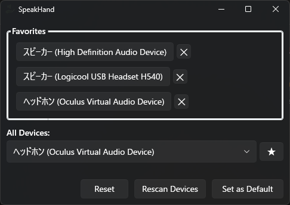

# SpeakHand

Windows用のシンプル＆モダンなオーディオデバイス切り替えツール（WPF/.NET 9.0）

## 特徴

- ワンクリックで既定のスピーカー・ヘッドホンを切り替え
- お気に入りデバイス登録＆パネル表示
- 簡潔でわかりやすいUI
- 設定はJSONで自動保存

## スクリーンショット

  
  

## 使い方

1. exeを起動
2. デバイス一覧から切り替えたいスピーカー/ヘッドホンを選択
3. 「お気に入り」に追加するとパネルに表示
4. お気に入り登録済みのデバイスは1クリックで簡単切り替え

## ビルド方法(Releaseにビルド後の実行ファイルが存在します)

1. .NET 9.0 SDKをインストール
2. リポジトリをクローン
3. `dotnet publish -c Release -r win-x64 --self-contained true -p:PublishSingleFile=true -p:IncludeNativeLibrariesForSelfExtract=true`
4. `bin/Release/net9.0-windows/win-x64/publish/` にexeが生成されます

## 依存ライブラリ

- [NAudio](https://github.com/naudio/NAudio)
- [WpfAnimatedGif](https://github.com/thomaslevesque/WpfAnimatedGif)
- System.Text.Json (.NET標準)

## ライセンス

MIT License
